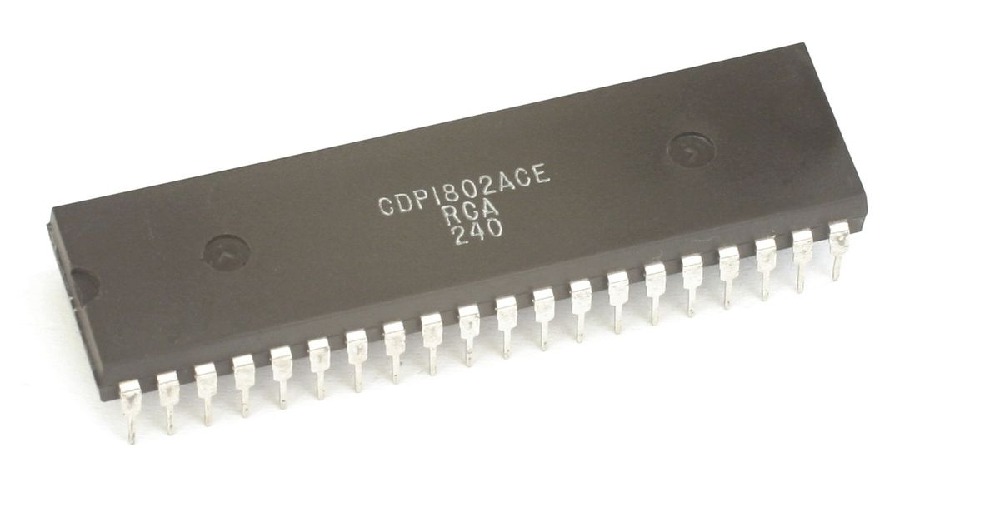

Built in 1976, and used in the microcomputer system within the same year, the RCA 1802 was one of the first microprocessors to be developed with CMOS (Complementary Metal-Oxide-Semiconductor).  The RCA 1802 microprocessor had no minimum clock frequency and no designated program counter. The odd design for this processor resulted in the ability to suspend the microprocessor at 0 Hz without affecting the operations, RISC (reduced instruction set capabilities) implementation, and DMA (direct memory access) capabilities. The chip’s low power consumption and better than average resistance to electrostatic discharge made it a perfect chip for space exploration applications and was used in the Galileo.  

## Machine programming

In any CPU, instructions are normally executed in sequence and a program counter is used to address the instructions stored in memory. One of the most unique assets of the COSMAC architecture is the capability to assign any one of the sixteen registers as a program counter in a single instruction. Now it is possible to maintain multiple pointers to different programs simultaneously and transfer the control of program counters quickly. A register is assigned as program counter by the 4-bit register P for various executions using the SEP (Set Pointer) instruction, and another register can be assigned as index register by using the SEX (Set X register) instruction.

## ALU

The 8-bit ALU performs the arithmetic operations required during program execution and, in general, works only with the data bus and register D. The byte stored in the D register will act as one operand while the second byte is obtained from memory and gated on the bus. The resultant byte after performing arithmetic will replace the operand in D and a s1-bit register DF is set to “0” or “1”. If the DF is set to “0” it means that no carry resulted from the add or shift operations and the “1” indicates that a carry did occur. DF = “0” during any subtraction if the subtrahend is larger than the minuend, which indicates that a borrow has occurred.

## Memory

The direct interconnection of a static 32-byte RAM to the CPU describes the use of memory interface line. No external parts are required. For memories requiring more than eight addressing bits, Fig. 5.1 illustrates the interconnections of a static 1024-byte RAM to the CPU. The 1024-byte read-write memory comprises eight 1024-word by one-bit CDP 1821 RAM’s. These static RAM’s requiring only a single power supply and it is  very easy to use. Ten memory address bits are required to select 1 out of 1024 memory byte locations.

## The "Big" picture

RCA1802(CDP1802) instruction additions boosted the processors math and branching capabilities when it first introduced in 1976. The COSMAC architecture is classified as 8-bits when the registers were 16-bits and processor had 16-bit addressing. This allows registers oriented architecture made for very clean efficient programming. Furthermore, the chip’s low power consumption and better than average resistance to electrostatic discharge which is ideal for space exploration applications. The COSMAC pipeline was primarily utilizes DMA to transfer data while CPU execute other instructions. CDP1802 can be expanded up to 65,536 bytes of memory by utilizes combination of RAM and ROM while MRD and MWR CPU lines determine read and write interaction between the two. Overall, RCA1802 is an amazing processor and very effective for few command lines.
