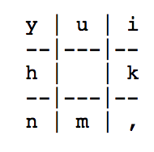
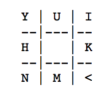

Minefield Map
You use the keyboard to in any of the 8 directions from his current position by using the 8 keys surrounding the 'j' key:

Asy ou moves through the field, there will be indication of safe cells (cells known to not contain a mine) on the map.
To help make this game simpler, the map is equipped with a "proximity probe" which tells the player how many mines there are in the 8 cells surrounding him (today's modern Army has all the coolest gadgets). Unfortunately, but the probe cannot where those mines are, just how many. Furthermore players are equipped with a limited number of hi-tech indicating flags to use to indicate cells to avoid by others behind him. He may plant a flag (using the keyboard) in any of the 8 surrounding cells when he suspects there is mine there. The keys to plant a flag are the shifted versions of the movement keys: 

When planted, the flag will indicate whether there is a mine there or not.

To win this game, player will earns 1 point for each new safe cell he finds by moving into it. In addition, he earns 2 points for each flag plants correctly in a cell that contains a mine. However, you will loses 1 point for each flag he plants in a cell that does not contain a mine.
If playersuccessfully makes it to the other side of the minefield, he earns a bonus of 10 points.

The game ends when player either reaches the other side of the field :-), or gets blown up by stepping on a mine :-(.

For this project, we worked in group of 3 and I was working mainly on the planting flag part while my teammate worked on the other area. Once we complete all the parts, we merge the codes together and debug. 

