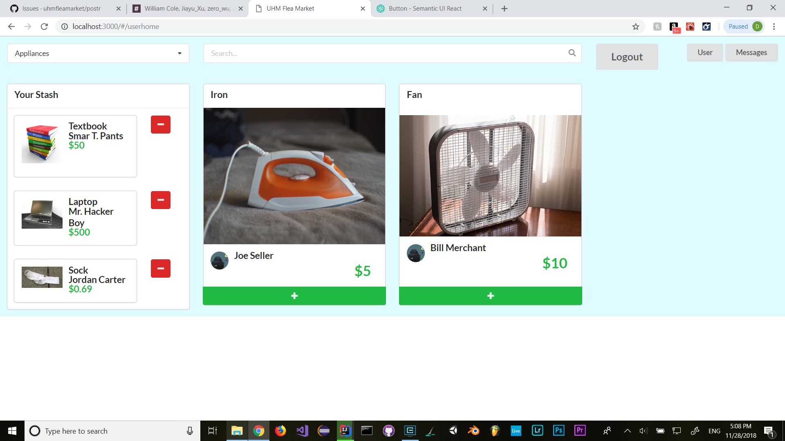

The UHM Flea Market is a Meteor application that will offer UHM students a chance to buy and sell everyday college needs, safely.

- Have students login with their UH credentials to access the system
- Connect buyers and sellers through UH credentials
- Items and services offered on this site will be geared specifically towards UHM students
images

[Here](https://uhm-flea-market.meteorapp.com/) a demo of the UHM Flea Market

[Here](https://uhmfleamarket.github.io/postr/) the user guide UHM Flea Market

My personal goal for this project is to have to get more experience on application creation. I find these experiences to be very useful in the field and it a good presentation to shows what I have work on and skill. Making selling produce page have become a very common in the modern day, it will be useful when I want to create my own product page in the future.

From this project, I gain a lot of experience creating application and teamwork. I’m responsible for creating the landing page, user home page, constant style and polishing, and the merging all the small issue to the master in github. Furthermore, I was in charge of our homepage. Merging all the branches in github is proved to be difficult, unless the master is constantly been update.

  

